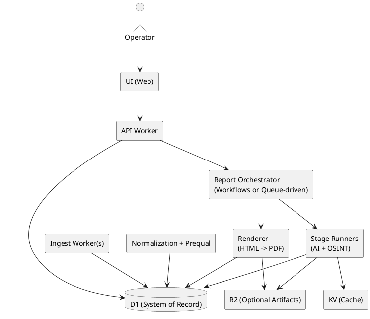
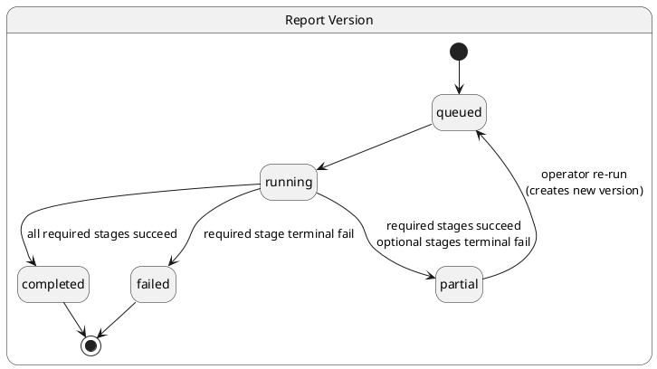

# SPEC-1 — Permit Intel (Solo Operator) — Architecture Spec (Revised)

> Revision date: 2026-03-08  
> Scope: **Single-operator intelligence workbench** (not multi-tenant SaaS).

## Background

Permit Intel turns noisy municipal building permit data into **sellable commercial lead dossiers** for a solo broker. The product value comes from:

- **Signal acquisition:** multi-city ingest + deterministic filtering.
- **Intelligence production:** staged AI + OSINT enrichment with evidence.
- **Broker memory:** a durable entity/evidence graph that compounds over time.

This revision addresses prior risks around **state machines, AI contract normalization, entity resolution, evidence/version semantics, export rendering, and retrieval/index strategy**.

## Requirements (MoSCoW)

### Must Have
- Multi-city ingest (Chicago, Seattle, Cincinnati, Denver, Austin) via adapters into a canonical permit schema.
- Deterministic prequalification to eliminate low-value noise **before** any expensive enrichment.
- Ranked shortlist view; operator can **select** permits and run enrichment on-demand.
- Multi-step enrichment pipeline with provider failover and strict JSON validation.
- Immutable evidence capture with provenance for every derived claim.
- Broker-ready exports: **Operational Dossier** + **Resale Playbook** (HTML + PDF).
- Strong idempotency and safe retries (no duplicated emails, exports, or entity merges).
- Operator controls: manual override, locks, and review gates for fuzzy matches.
- Observability: run history, stage timings, errors, provider fallbacks.

### Should Have
- Entity resolution with merge + **unmerge** support and lineage retention.
- Saved searches / query views (GC, owner, address, city, time window).
- Regeneration: re-run reports with a new version while preserving snapshots.

### Could Have
- R2 artifact storage (PDFs, screenshots) once volume warrants it.
- Additional cities and feeds (CSV dumps, HTML scrapes, ArcGIS, Socrata).

### Won’t Have (MVP)
- Multi-tenant user management, billing, or public-facing portal.
- Automated outreach (email/SMS) without explicit operator action.

---

## System Overview

### High-level flow

1. **Ingest** permit rows from city sources into `permits` + `permit_sources`.
2. **Normalize** and compute deterministic `prequal_score` + `prequal_reasons`.
3. Present **shortlist** to operator; operator chooses a permit.
4. Create a **report run** with an immutable snapshot of inputs.
5. Run **staged enrichment** (AI + OSINT) with strict contracts.
6. Generate **HTML** dossier + playbook; optionally render **PDF**.
7. Persist outputs + evidence; update **entity graph**.
8. Operator reviews and exports.

### Architecture components (Workers-first)

### Storage boundaries

- **D1**: durable queryable store of record (permits, reports, entities, evidence metadata, exports).
- **KV**: *cache only* (e.g., fetched web page text, temporary model responses) with TTL; safe to drop.
- **R2 (optional)**: large binaries (PDFs, images, screenshots). MVP may keep PDFs as bytes if small, but **interface must allow switching to R2 without schema break**.

---

## Canonical State Machines

A single canonical state model avoids inconsistent transitions across services.

### Permit lifecycle (`permits.status`)
- `new` → `normalized` → `prequalified` → `shortlisted`  
- Terminal: `rejected` (noise), `archived`

### Report lifecycle (`reports.status`)
- `draft` (created, not queued)
- `queued` (submitted for execution)
- `running`
- `partial` (some stages succeeded, some failed; usable but flagged)
- `completed`
- `failed` (terminal failure)
- `superseded` (a newer report version exists)
- `archived`

### Stage attempt lifecycle (`stage_attempts.status`)
- `queued`
- `running`
- `succeeded`
- `retrying`
- `failed_retryable`
- `failed_terminal`
- `skipped` (gated by operator or dependency)

### Export lifecycle (`exports.status`)
- `draft`
- `rendering`
- `ready`
- `delivered` (if emailed/downloaded)
- `failed`

**Rules**
- Every transition is recorded in `report_events` / `stage_events` (append-only).
- A report version is **immutable after completion**. Regeneration creates a new version with a new snapshot.

---

## Report Versioning & Snapshot Semantics

### Immutable snapshot inputs
When creating a report version, persist:
- canonical permit record as-of-run,
- parsed text fields used by pipeline,
- operator notes/flags,
- deterministic prequal outputs,
- selected evidence pointers.

This prevents “moving targets” as city data changes or entity merges occur later.

### Regeneration strategy
- `reports` is the logical report container.
- `report_versions` holds immutable snapshots and outputs.
- `reports.active_version_id` points to current.

---

## Evidence Model (Immutable)

**Evidence is immutable.** Derived summaries can be regenerated, but evidence must remain traceable.

- `evidence_items`: immutable records with `type`, `source`, `retrieved_at`, `hash`, and `storage_ref`.
- `evidence_links`: ties evidence to permits, entities, report versions, or exports.
- `derived_claims`: extracted claims referencing evidence IDs and confidence.

**No evidence deletes.** Retractions are new records (e.g., `evidence_items.status = deprecated`), preserving auditability.

---

## AI/OSINT Pipeline Contracts

### Pipeline stages (example)
1. `permit_parse` — normalize raw fields + classify project type.
2. `scope_summary` — human-readable scope + buyer fit.
3. `entity_extract` — extract candidate entities (owner, GC, architect, engineer).
4. `osint_enrich` — fetch corroborating evidence (web pages, registries).
5. `contact_discovery` — candidate contacts with provenance.
6. `dossier_compose` — produce structured dossier + playbook blocks.

### Provider normalization layer

All providers are wrapped behind `LLMClient`:

- Enforces **exact JSON schema** per stage.
- Adds `model_id`, `provider`, `latency_ms`, `token_counts`.
- Implements retries with:
  - exponential backoff,
  - provider fallback sequence,
  - max attempts per provider,
  - circuit-breaker on repeated provider failures.

**Idempotency**
- Each stage attempt key: `sha256(report_version_id + stage_name + stage_input_hash + prompt_version)`.
- If a request is retried, it must reuse the same idempotency key so outputs are deduped.

### Validation
- **Syntactic**: JSON parse + schema validate (reject unknown fields).
- **Semantic**: confidence thresholds, required evidence links, and cross-field rules (e.g., phone format).
- Failed semantic validation is `failed_retryable` if it can be improved by re-prompting.

---

## Entity Resolution and Merge Policy

Entity resolution is **review-first** to avoid corrupting the graph.

### Identity objects
- `entities` represent a real-world person/org/place.
- `entity_aliases` store raw names, spellings, addresses, and identifiers with sources.
- `entity_identifiers` store strong identifiers (license #, website domain).

### Match tiers
- **Exact match (auto-link):**
  - same strong identifier; or
  - normalized name + exact address match + high confidence.
- **Probable match (review required):**
  - fuzzy name similarity + partial address + shared evidence.
- **Possible match (no merge):**
  - weak similarity; stored as `candidate_link` only.

### Merge ledger
- Merges create a `merge_ledger` entry capturing:
  - `winner_entity_id`, `merged_entity_id`,
  - rule + confidence,
  - operator decision,
  - and a **full before/after diff**.
- **Unmerge** is supported via `unmerge_ledger` restoring previous state using the diff.

### Operator locks
- `operator_locks` can pin an entity, alias, or identifier to prevent automated merges.

---

## Retrieval & Index Strategy

The product lives or dies by fast operator queries. Use **read projections** in D1:

- `permit_search_view`: denormalized fields for filtering/sorting.
- `entity_activity_view`: entity ↔ permit/report occurrences with last-seen, frequency.
- `lead_pipeline_view`: permits in shortlisted/prequalified with buyer-fit scoring.
- `contact_directory_view`: verified contacts by role, city, company.

Index for the top operator queries:
- by `city`, `filed_date`, `work_type`, `valuation`, `prequal_score`
- by `address_norm`
- by `entity_id` occurrences (join table indexes)
- by `report_status`, `updated_at`

---

## Export Rendering (HTML-first)

**Decision:** generate canonical HTML for dossier/playbook; PDF is derived.

- `export_templates` versioned (template_version).
- `exports` store:
  - template version,
  - data snapshot ref (report_version_id),
  - HTML bytes (or R2 ref),
  - PDF bytes/ref.

Rendering steps:
1. Compose **structured JSON** sections (`dossier_sections`).
2. Render HTML via server-side template.
3. Optional: render PDF from HTML (headless browser / rendering service).
4. Store artifact refs and checksums.

---

## Observability & Ops

- Every run has `run_id`, `stage_attempt_id`, timings, provider, model.
- Dashboards:
  - pipeline latency by stage,
  - provider fallback rate,
  - semantic validation failure reasons,
  - ingestion freshness per city.
- Alerts:
  - ingestion stalls (no new permits in N hours),
  - repeated provider failures,
  - unusually high merge/unmerge rates.

---

## Implementation Notes (MVP defaults)

- Use D1 transactions for:
  - stage attempt creation + idempotency guard,
  - merge/unmerge ledger writes,
  - report version creation.
- Use queue/workflow orchestration for stage execution to avoid request timeouts.
- Keep KV strictly as cache; do not store canonical outputs only in KV.
